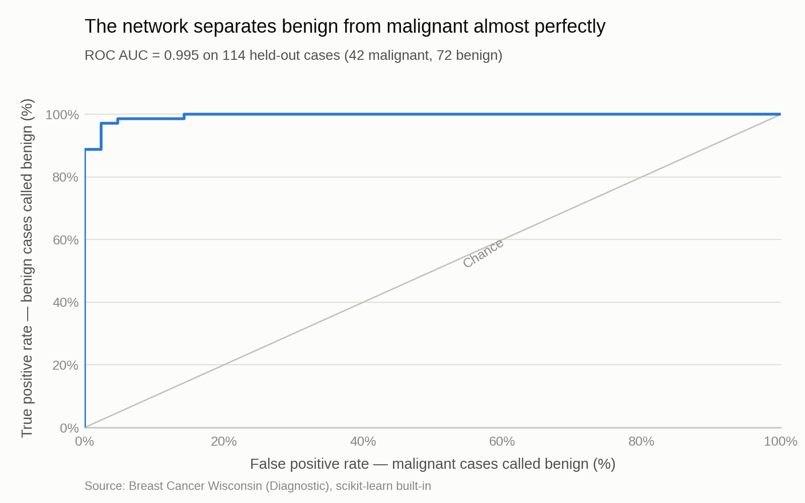
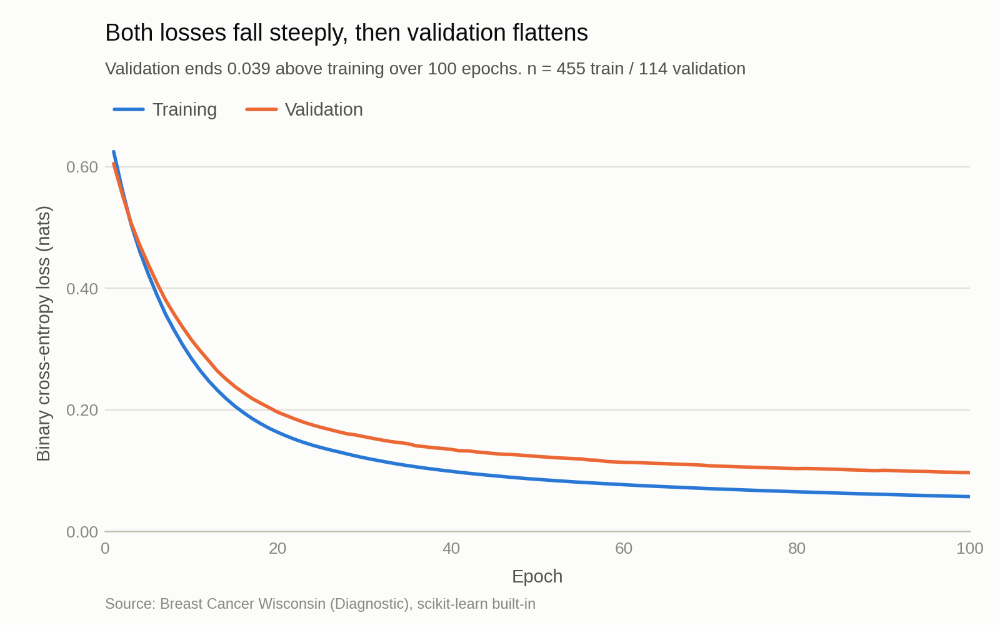
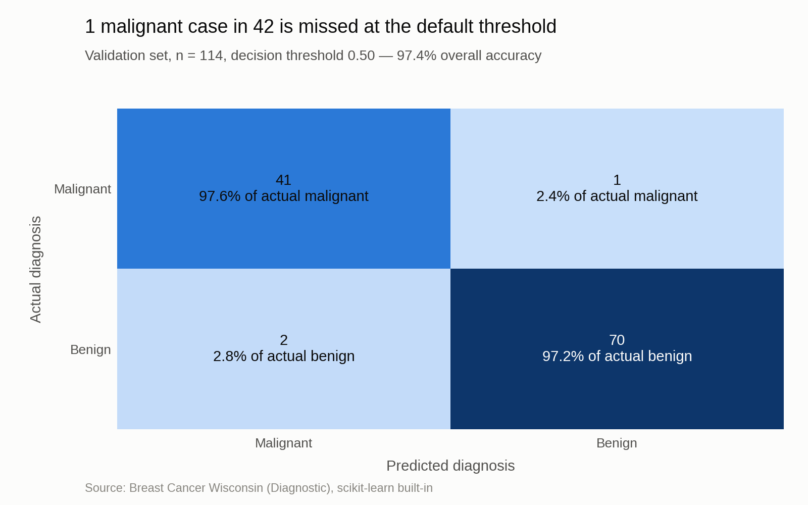

<p align="center">
  
</p>

<h1 align="center">Neural Network From Scratch — Breast Cancer Diagnosis</h1>

<p align="center">
  A 3-layer feed-forward classifier written in pure NumPy — forward pass, backprop and
  mini-batch gradient descent all hand-derived — that diagnoses breast tumours as malignant
  or benign from 30 cell-nucleus measurements at <b>97.4% accuracy</b> and <b>0.995 ROC-AUC</b>.
</p>

<div align="center">
  
  
  
  
  
  <br>
  <a href="https://github.com/VishnujanNarayanan"></a>
  <a href="https://www.linkedin.com/in/vishnujan-narayanan"></a>
  <a href="https://substack.com/@vishnujannarayanan"></a>
</div>

No autograd, no Keras, no PyTorch. `NeuralNN` is 60 lines: He initialisation, ReLU hidden
layers, a sigmoid output, binary cross-entropy loss, L2 weight decay, and a manually
vectorised backward pass.

## Results

| Metric | Value |
| --- | --- |
| Validation accuracy | **97.37%** (111 / 114) |
| ROC-AUC | **0.9954** |
| Malignant recall | 97.6% (41 / 42) |
| Benign recall | 97.2% (70 / 72) |
| Trainable parameters | 641 |
| Training time | ~3 s on CPU |

<p align="center">
  
</p>
<p align="center"><i>Both curves fall together for all 300 epochs — validation ends just 0.024 above training, so the network is not overfitting.</i></p>

<p align="center">
  
</p>
<p align="center"><i>At the default 0.50 threshold the model misses one malignant case in 42 and raises two false alarms.</i></p>

## Dataset

**Breast Cancer Wisconsin (Diagnostic)** — 569 digitised fine-needle-aspirate images, each
described by 30 real-valued features (mean, standard error and "worst" of ten nucleus
measurements such as radius, texture, area and concavity).

| | |
| --- | --- |
| Shape | 569 rows × 30 features |
| Classes | 212 malignant (37.3%), 357 benign (62.7%) |
| Split | 455 train / 114 validation, stratified, `random_state=42` |
| Licence | CC BY 4.0 (UCI ML Repository) |

No download required — the dataset ships inside scikit-learn and is loaded with
`sklearn.datasets.load_breast_cancer()`. The original is
[UCI dataset 17](https://archive.ics.uci.edu/dataset/17/breast+cancer+wisconsin+diagnostic).

## Approach

1. **Load and split.** 569 samples split 80/20, stratified on the diagnosis so both sets keep
   the 37/63 class balance.
2. **Standardise.** Raw features span four orders of magnitude — `mean area` runs 143–2501
   while `mean smoothness` runs 0.053–0.163. A `StandardScaler` is fitted on the training
   split *only* and applied to both, so no validation statistics leak into training.
3. **Build the network.** Layers `[30, 16, 8, 1]`. Weights use He initialisation
   (`randn * sqrt(2/fan_in)`), correct for ReLU. Hidden layers are ReLU, the output is a
   sigmoid producing P(benign).
4. **Train.** 300 epochs of mini-batch gradient descent, batch 32, learning rate 0.01, L2
   weight decay 1e-4, reshuffled every epoch. Backprop is derived by hand and fully
   vectorised — the sigmoid-with-BCE output layer collapses to `dZ = A - y`.
5. **Evaluate.** Accuracy, ROC-AUC and a confusion matrix on the held-out split, plus a
   threshold sweep to test whether the one missed malignancy is recoverable.

## Installation and usage

```bash
git clone https://github.com/VishnujanNarayanan/Neural_net_from_scratch.git
cd Neural_net_from_scratch

python3 -m venv .venv
source .venv/bin/activate        # Windows: .venv\Scripts\activate

pip install -r requirements.txt
```

Run the analysis end to end and regenerate every figure in `figures/`:

```bash
jupyter nbconvert --to notebook --execute --inplace NeuralNet_BreastCancer.ipynb
```

Or open it interactively:

```bash
jupyter lab NeuralNet_BreastCancer.ipynb
```

Both write `figures/01_loss_curve.png`, `02_roc_curve.png` and `03_confusion_matrix.png` at
1600×1000. All figure styling comes from `viz_style.py`; notebooks never set colours or fonts.

## Project structure

```
Neural_net_from_scratch/
├── NeuralNet_BreastCancer.ipynb   # The project: NeuralNN class, training, evaluation, figures
├── viz_style.py                   # Shared figure style — palette, type scale, layout, save path
├── figures/                       # Generated PNGs, 1600x1000, overwritten on each run
│   ├── 01_loss_curve.png
│   ├── 02_roc_curve.png
│   └── 03_confusion_matrix.png
├── Image_classifier.ipynb         # Side experiment: multi-task age/gender net (needs UTKFace, not included)
├── image_classifier2.ipynb        # Refactor of the above; not part of the pipeline described here
├── requirements.txt
├── LICENSE
└── README.md
```

## Findings

- **A 641-parameter network is enough.** Hand-written backprop reaches 97.37% accuracy and
  0.9954 ROC-AUC on 114 held-out cases — within noise of scikit-learn's tuned estimators on
  this dataset. The problem is close to linearly separable once features are standardised.
- **The model is underfitted, not overfitted.** After 300 epochs validation loss is still
  falling and sits only 0.024 above training loss. The usual portfolio failure mode —
  memorising 455 rows with a curve that turns upward — never appears; more epochs or more
  capacity would likely still help.
- **The one missed malignancy is not a borderline call.** It scores P(benign) = 0.732, above
  the 10th percentile of genuinely benign cases (0.730). Raising the threshold to 0.60 or
  0.70 does not recover it; only 0.80 does, and that turns 2 false alarms into 13 while
  dropping accuracy to 88.6%. This case is confidently wrong, so threshold tuning is the
  wrong lever — it needs better features or more data.
- **Separation is near-total elsewhere.** Median P(benign) is 0.012 for malignant cases and
  0.953 for benign ones. The 0.50 threshold sits in an almost empty region, which is why
  accuracy is stable across 0.30–0.60.
- **Standardisation is doing real work.** With `mean area` (143–2501) and `mean smoothness`
  (0.053–0.163) on the same input layer, unscaled gradients are dominated by the
  large-magnitude columns and training stalls.

## Author

<p align="center">
  <strong>Vishnujan Narayanan</strong>
</p>

<p align="center">
  <a href="https://github.com/VishnujanNarayanan"></a>
  <a href="https://www.linkedin.com/in/vishnujan-narayanan"></a>
  <a href="https://substack.com/@vishnujannarayanan"></a>
</p>

## Licence

Released under the MIT Licence — see [LICENSE](LICENSE).
